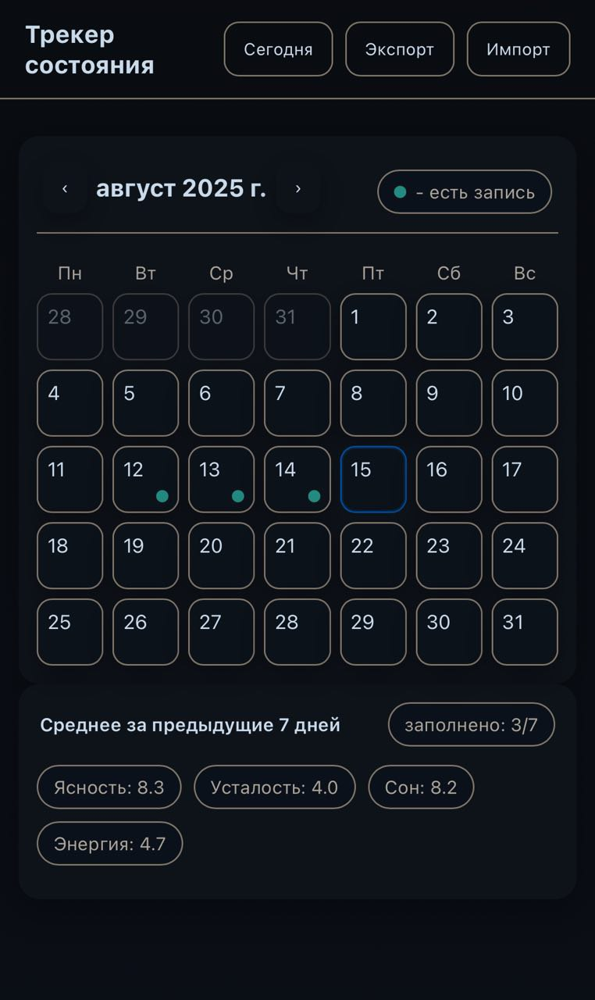
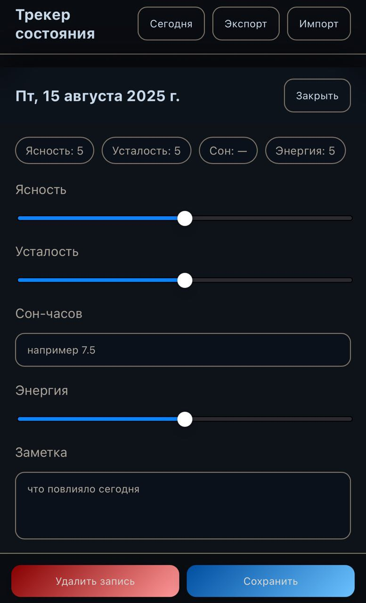

# Трекер состояния

Прототип веб-приложения для отслеживания личных показателей (ясность, усталость, сон, энергия) в календарном виде.  
Все данные сохраняются **локально в браузере** (LocalStorage) с возможностью экспорта и импорта в формате JSON.

## Статус
Проект в разработке.
Проект был сделан исключительно для себя.
Сейчас вся логика и стили находятся в одном файле **index.html** (полотно :D).  
В планах:
- Разделить код на модули (JS, CSS, HTML)
- Улучшить структуру и оформление
- Добавить новые функции и улучшить UX

Ссылка: https://temeka1221.github.io/wellness-tracker/
